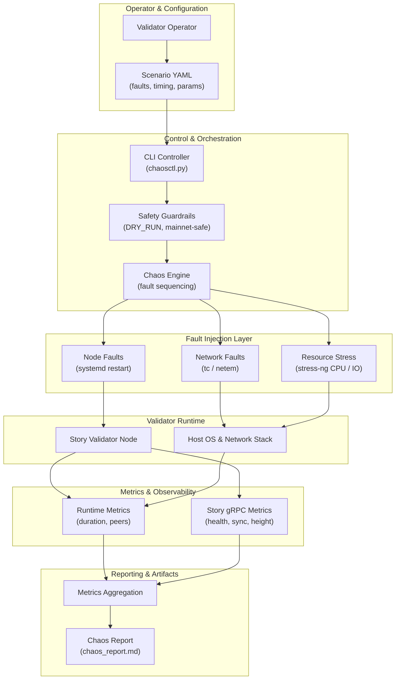

# 🚀 Astrosynx — Stress & Chaos Testing Suite

Production-oriented **chaos & stress testing toolkit** for **Story validator nodes**.  
Designed to safely simulate real-world failure conditions, measure recovery behavior, and improve operational resilience **before incidents happen**.

---

## 🧠 What Is This?

Astrosynx Stress & Chaos Testing Suite is a **scenario-driven framework** that allows validator operators to deliberately introduce controlled failures into their infrastructure and observe how systems behave under pressure.

The goal is **not to break the network**, but to answer critical operational questions:

- How fast does a node recover after failure?
- Does it rejoin peers correctly?
- Are monitoring and alerting systems reacting in time?
- Which configurations degrade silently under load?

---

## ✨ Key Features

✅ Scenario-based fault injection (YAML)  
🌐 Network degradation (latency, packet loss)  
🔁 Validator service restarts (systemd)  
🔥 CPU & IO stress testing (`stress-ng`)  
📡 gRPC-level Story observability  
📊 Recovery & MTTR measurement  
🛡️ Safe-by-default execution (`DRY_RUN`)  
🧩 Modular & extensible architecture  

---

## 🧱 High-Level Architecture



---

## 💥 Fault Injection Types

### 🌐 Network Faults
- Artificial latency injection
- Packet loss simulation
- Connectivity degradation scenarios

### 🔁 Node Faults
- Controlled validator service restarts
- Recovery and resync behavior validation

### 🔥 Resource Pressure
- CPU saturation
- Disk / IO contention
- Combined stress scenarios via `stress-ng`

---

## 📊 Metrics Collected

📈 Execution duration  
🔗 Peer count before / after faults  
📡 gRPC reachability  
⛓️ Block height visibility  
🔄 Syncing status  
⏱️ Recovery behavior indicators  

These signals allow **direct correlation** between injected failures and actual protocol-level behavior.

---

## 🛡️ Safety Model

Safety is enforced at the framework level:

- 🧯 `DRY_RUN=1` enabled by default  
- 🚫 Mainnet → automatic safe-mode  
- 🔄 Explicit rollback for all faults  
- ⚠️ No cascading or parallel faults by default  

This makes the suite suitable for **real infrastructure testing** without unnecessary risk.

---

## 🧪 Example Scenario

```yaml
scenario: cpu_io_pressure
network: testnet

faults:
  - type: node.resource_stress
    duration: 30
    params:
      cpu: 4
      io: 2
      timeout: 30
```

---

## ⚙️ Installation

```bash
git clone https://github.com/astrosynx/chaos-suite
cd astrosynx-chaos-suite
pip install -r requirements.txt
```

### System dependencies

- `tc`
- `stress-ng`
- `systemd`

## ▶️ Usage

```bash
python orchestrator/chaosctl.py examples/network_latency.yaml
```

Dry-run mode is applied automatically unless explicitly disabled.

---

## 🧩 Typical Use Cases

- Validator resilience testing  
- Upgrade & restart validation  
- Monitoring and alerting verification  
- Infrastructure comparison  
- Operational readiness assessments  

---

## 🛣️ Roadmap

🔜 MTTR timelines & recovery graphs  
🔜 Missed block correlation  
🔜 Peer churn analytics  
🔜 Mainnet-safe fault profiles  
🔜 Cross-network support  

The framework is designed to **scale beyond Story** and be adaptable to other blockchain networks.
